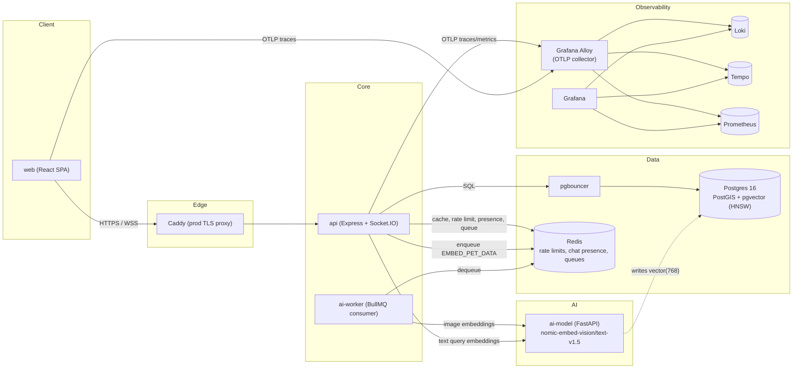

# Where's Fluffy 🐾

A real-time lost-and-found platform for pets: report a missing animal with a location, let
nearby users leave location-tagged sightings, and open a live chat between owner and finder the
moment a sighting is confirmed.

[](.github/workflows/ci.yml)


> A license has not been chosen for this repository yet — see [POLISH.md](POLISH.md).

---

## Overview

Where's Fluffy is split into two independently-deployable pieces that share nothing but an HTTP
API contract:

- **`src/`** — an Express 5 + Socket.IO API backed by Postgres/PostGIS (geo queries), pgvector
  (visual similarity search), Redis (rate limiting, chat presence, BullMQ), and a self-hosted
  vision-embedding sidecar.
- **`web/`** — a React + Vite SPA with a Leaflet map explorer, TanStack Query data layer, and a
  Socket.IO client for chat.

The product flow: a user reports a missing pet at a location → other users drop location-tagged
sighting comments → once a sighting is confirmed, the owner and the finder get a real-time chat
room, access to which is gated by a Postgres-verified, Redis-cached trust boundary (see
[Chat access control](#chat-access-control) below).

## Architecture



In production, `Caddy` is the only publicly-exposed port (80/443); every backing service —
Postgres, Redis, the embedding sidecar, and the entire observability stack — stays on the
internal Docker network.

## Key architectural decisions

- **Functional DI, no classes.** Every module (`pets`, `auth`, `chat`, `comments`, `map`,
  `feed`, `search`, …) follows the same `createX(deps)` factory shape —
  `createPetRepository(prisma)` → `createPetsService(petRepository)` → `createPetsController(...)`
  — composed once as a module-level singleton in that module's own `index.ts`. Repositories are
  the only layer that touches Prisma directly, which is what lets every service be unit-tested
  against a hand-rolled mock instead of a real `PrismaClient`.

- **Vision-only embedding pipeline.** `Pet.embedding` (`vector(768)`, pgvector, HNSW/cosine
  index) is computed exclusively from pet photos — never from name/species/distinguishing-marks
  text — via a self-hosted FastAPI sidecar running aligned **nomic-embed-vision-v1.5** and
  **nomic-embed-text-v1.5** towers in one shared 768-dim space. That alignment is what makes a
  natural-language search query match photo-only embeddings cross-modally. Writes happen
  asynchronously: `pets.service.ts` enqueues a BullMQ job on create/photo-change, `ai-worker`
  consumes it — the API path never blocks on inference, and a `fake` embedding provider keeps
  the whole pipeline runnable in CI/dev without the sidecar.

- **Dual-query map explorer.** The map view and the results list are deliberately *not* one
  endpoint feeding two components: `GET /map/pins` returns a minimal, hard-capped, unpaginated
  array for cheap marker rendering, while `GET /pets/feed` (extended with an optional `bbox`
  mode, mutually exclusive with its original `lat/lng/radius` proximity mode) returns the full
  paginated DTO for the results drawer. Both share one `bboxSchema` for parsing/validation.

- **Chat access control as a Redis trust boundary.** Postgres is checked exactly once, when a
  socket sends `join_chat` (verifying owner/finder membership); a successful check is cached in
  Redis (`access:<userId>:<roomId>`, 1h TTL). Every subsequent `send_message` only checks that
  Redis key — not the database — trading a small staleness window for avoiding a DB round-trip
  on every chat message.

- **Layered, Redis-backed rate limiting.** Four independent limiters (HTTP global, HTTP
  per-route, WS connection, WS per-event) all run on `rate-limiter-flexible` against the *same*
  general-purpose Redis client used elsewhere in the app — deliberately never the Socket.IO
  adapter's pub/sub clients, which cannot run arbitrary commands once subscribed.

- **Centralized error handling.** A single `AppError`/`createAppError`/`isAppError` shape
  (no `class`, no `any`) flows through one Express error-handling middleware; Zod validation
  happens at the route layer via a `validate(schema)` middleware, not inline in controllers.

- **Full-stack observability, not just logs.** Both `api` and `web` emit OpenTelemetry
  traces/metrics to a single Grafana Alloy collector, which fans them out to Loki (logs),
  Tempo (traces), and Prometheus (metrics) — pre-wired with trace↔log↔metric correlation in
  Grafana's provisioned datasources, so a slow request can be followed from a log line to its
  trace to its RED metrics without leaving the UI.

- **Graceful shutdown.** `SIGTERM`/`SIGINT` close, in order: the HTTP server, Socket.IO, Prisma,
  and all three Redis connections (the general client plus the adapter's pub/sub pair) — leaving
  any one of them open would keep the process alive past `server.close()`.

## Tech stack

| | |
|---|---|
| **Backend** | Express 5 · TypeScript · Prisma 6 · Socket.IO 4 (+ Redis adapter) · BullMQ · Zod 4 · JWT (httpOnly cookie) + Google/Facebook OAuth · pino |
| **Frontend** | React 18 · Vite · TanStack Query 5 · React Router 6 · Leaflet + marker clustering · Zustand · Tailwind CSS + shadcn/ui · Socket.IO client |
| **Data** | Postgres 16 (PostGIS + pgvector/HNSW) · pgbouncer · Redis |
| **AI** | Self-hosted FastAPI sidecar · nomic-embed-vision-v1.5 / nomic-embed-text-v1.5 (CPU, sentence-transformers/transformers) |
| **Infra & Ops** | Docker Compose · Caddy (prod TLS) · Grafana Alloy · Loki · Tempo · Prometheus · Grafana · GitHub Actions |

## Repository layout

```
src/                      # Backend (own package.json / tsconfig)
  modules/
    pets/ auth/ chat/ comments/ feed/ map/ search/ geocode/ location/ seo/ health/
    sightings/            # placeholder — not yet implemented
  common/                 # placeholder — not yet implemented
  shared/                 # errors, middleware, rate-limit, embedding, infrastructure, ...
  ai-worker/              # BullMQ consumer entrypoint (second entrypoint of the same image)
  prisma/                 # schema.prisma + migrations
  scripts/                # backfill-embeddings.ts, ...

web/                      # Frontend (own package.json / tsconfig, sibling to src/)
  src/
    modules/              # app, auth, chat, feed, geocode, landing, location, map, pets, profile
    shared/                # ui/, lib/, components/, config/

shared-types/             # placeholder — not yet implemented

infra/
  ai-model/               # FastAPI embedding sidecar (Dockerfile, pytest suite run at build time)
  alloy/ grafana/ prometheus/ tempo/ caddy/ db/

tests/
  observability/          # end-to-end trace/log/metric smoke test against a running stack
  perf/k6/                # HTTP + WebSocket load tests
```

`shared-types/`, `src/modules/sightings/`, and `src/common/` are reserved for future work — don't
assume code exists there yet.

## Getting started

**Prerequisites:** Docker + Docker Compose, Node.js 22.

```bash
# 1. Infra: Postgres+PostGIS+pgvector, pgbouncer, Redis, the embedding sidecar, and the
#    observability stack
docker compose up -d

# 2. Backend
cd src
npm install
npx prisma migrate dev
npm run dev             # tsx watch main.ts — API + WS server on :3000

# 3. Frontend, in a separate shell
cd web
npm install
npm run dev             # Vite dev server
```

Optional: browse the database with Prisma Studio (loopback-only, no built-in auth):

```bash
docker compose --profile admin up -d prisma-studio   # http://localhost:5555
docker compose --profile admin down prisma-studio    # tear down when done
```

## Environment variables

Copy `src/.env.example` for local development — sensible defaults are provided for everything
except a handful of variables Docker Compose enforces at container start
(`${VAR:?required}` — no fallback, container refuses to start without them): `JWT_SECRET`,
Cloudinary credentials, and the OAuth client ID/secret pairs (Google/Facebook), unless their
respective kill switches are left in their default *disabled* state. `.env.production.example`
documents the fuller production variable set. There is currently no consolidated root-level
`.env.example` — see [POLISH.md](POLISH.md).

## Testing

```bash
cd src
npm run test:unit          # Jest, no Docker needed
npm run test:integration   # spins up real postgis/postgis containers via testcontainers
npm test                   # both

npm run test:observability # E2E: fires a real request, asserts a correlated trace/log/metric
                            # appear in Tempo/Loki/Prometheus — requires `docker compose up -d`
```

Load/soak testing lives outside `src/`, in `tests/perf/k6/`:

```bash
k6 run tests/perf/k6/load-test.ts -e BASE_URL=http://localhost:3000       # HTTP comment-creation load test
k6 run tests/perf/k6/ws-load-test.ts -e BASE_URL=http://localhost:3000    # chat join/send/echo load test
```

All four real backend modules (`pets`, `auth`, `chat`, `comments`) have unit and integration
coverage. The frontend currently has no automated test suite — see [POLISH.md](POLISH.md).

## Observability

`docker compose up -d` also brings up the full tracing/metrics/logging stack. Grafana is
reachable at `http://localhost:3001` (dev credentials `admin`/`admin`) with datasources
pre-provisioned for Loki, Tempo, and Prometheus, including cross-signal linking (logs → trace via
a `trace_id` derived field, trace → RED metrics via span-metrics, exemplars → trace). No
dashboards are shipped yet — only the datasource wiring.

## Deployment

Production is a Docker Compose overlay (`docker-compose.yml` + `docker-compose.prod.yml`) fronted
by Caddy for automatic TLS, with every backing service unpublished from the host network except
the reverse proxy. GitHub Actions (`.github/workflows/ci.yml`) runs backend (`tsc --noEmit` →
unit → integration → build) and frontend (`build`) jobs on every push, and a `deploy` job that
SSHes into the target host and re-deploys on pushes to `main`. Full operational detail —
required secrets, migration strategy, rollback — lives in [DEPLOY.md](DEPLOY.md).

## Known limitations

- `shared-types/`, `src/modules/sightings/`, and `src/common/` are placeholders, not partially
  broken features — they're intentionally empty pending future work.
- `web/` has no automated test suite yet (see [POLISH.md](POLISH.md)).
- A few frontend fields are deliberate, labeled placeholders awaiting backend support (e.g. a
  "pets helped" counter and a sighting reporter's display name) — not bugs, just not wired up to
  a real endpoint yet.

## License

No license has been chosen yet. See [POLISH.md](POLISH.md) for a recommendation.
